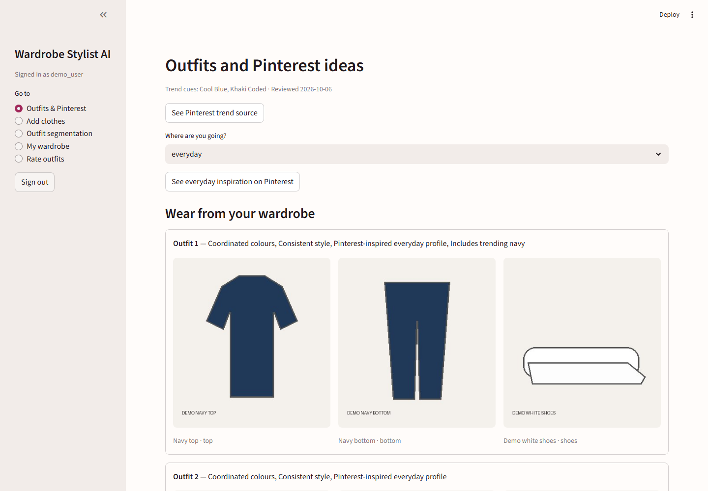

# Wardrobe Stylist AI

**Python · Streamlit · TensorFlow/Keras · MobileNetV2 · PyTorch · SegFormer-B0 · SQLite · Pillow · NumPy · pytest**

A local computer vision app that catalogues uploaded clothes, segments outfit photos, recommends combinations from your wardrobe, and opens Pinterest searches for items you may want to add.



*The illustrated garments were uploaded through the real app flow. Two incorrect shoe labels were manually corrected before this screenshot. [View the original predictions](docs/screenshots/04-upload-classification.png).*

## Features

- Automatic category prediction plus background-aware LAB colour clustering that learns from user corrections; supports JPG, JPEG, JFIF, PNG, and WebP uploads
- Outfit-photo segmentation into tops, bottoms, shoes, dresses, and outerwear
- Pinterest-inspired occasion profiles produce different everyday, college, office, and party combinations
- Editable wardrobe records, availability tracking, Pinterest searches, and outfit ratings
- Local accounts and SQLite storage; user data is ignored by Git

## Run locally

Use **Python 3.10–3.13**.

```shell
python -m venv .venv
# Windows: .\.venv\Scripts\Activate.ps1
# macOS/Linux: source .venv/bin/activate
python -m pip install -r requirements.txt
python -m streamlit run app.py
```

Open the displayed local URL, create an account, and upload clothes. TensorFlow and PyTorch make the initial installation relatively large.

## Model results

| Component | Result |
| --- | --- |
| Garment classifier | Frozen ImageNet MobileNetV2 backbone with a trained four-class head: **93.1%** product-image validation accuracy; **53.8%** on 160 independent Fashionpedia crops with context and **53.1%** on isolated crops. [Report](reports/classifier_fashionpedia_independent.json) |
| Outfit segmentation | ATR SegFormer plus a local Fashionpedia outerwear model: **0.5065** five-class mean IoU on a recorded 150-image Fashionpedia holdout, compared with **0.4481** for ATR alone. [Report](reports/fashionpedia_accuracy_holdout.json) |
| Outfit ranking | Rule-based colour, style, occasion, and trend scoring. Human usefulness ratings have not yet been collected. |

These benchmark photos differ from personal wardrobe photos, so users can review and correct predictions. Model hashes are checked before inference; the app falls back to verified ATR weights if the optional Fashionpedia component is invalid.

See the [model analysis](docs/model_analysis.md), [experiments and reproduction steps](docs/experiments.md), [wardrobe-photo dataset protocol](docs/wardrobe_dataset_protocol.md), and [third-party notices](THIRD_PARTY_NOTICES.md). Pinterest cues come from [Pinterest Predicts 2026](https://business.pinterest.com/pdf/pinterest-predicts/2026-trend-report/); links open searches rather than verified products.

## License

Original project code is available under the [MIT License](LICENSE).
